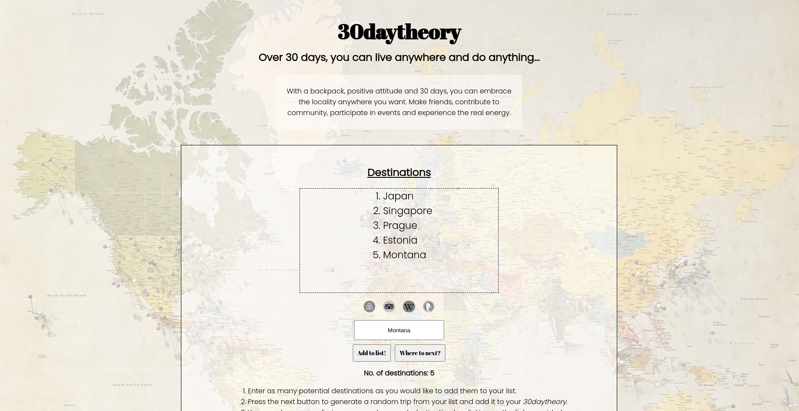

# 30DAYTHEORY

A travel inspiration website where you can create a list of destinations and randomly generate your next trip. You can also follow links to start researching your selected destination.

Link to site: <https://www.30daytheory.world>

## Table of Contents

-   [General Info](#general-information)
-   [Technologies Used](#technologies-used)
-   [Features](#features)
-   [Screenshots](#screenshots)
-   [Usage](#usage)
-   [Project Status](#project-status)
-   [Room for Improvement](#room-for-improvement)
-   [Acknowledgements](#acknowledgements)
-   [Contact](#contact)

## General Information

This project was created as freelance work, the client wanted me to create a site based around their idea of '30daytheory'.

## Technologies Used

-   HTML
-   CSS
-   JavaScript

## Features

-   Randomly generate your next trip from a list of destinations chosen by you
-   Click on the Airbnb, Tripadivsor, Wikipedia or DuckDuckGo links to begin your research
-   Get inspired to travel and embrace somewhere!

## Screenshots

## Usage

Enter as many potential destinations as you would like to add them to your list.
Press the next button to generate a random trip from your list and add it to your 30daytheory.
You can do some preliminary research on each destination by clicking on the links provided.
Book your trip and pack your bags!

## Project Status

Project is: _in progress_

The web app is live but I will continue to make improvements in the future.

## Deployment Status

Deployed

## Room for Improvement

-   Feedback is appreciated

## Acknowledgements

-   Fonts by Google Fonts
-   Icons by (<https://www.fontawesome.com>)
-   Coded using Atom text editor
-   Background image Photo by <a href="https://unsplash.com/@drewmark?utm_source=unsplash&utm_medium=referral&utm_content=creditCopyText">Andrew Stutesman</a> on <a href="https://unsplash.com/s/photos/world-map?utm_source=unsplash&utm_medium=referral&utm_content=creditCopyText">Unsplash</a>

## Contact

If you would like to contact me please send me a message on Discord @secondl1ght#9164 or by e-mail at secondl1ght@protonmail.com, I would love to hear from you!

Personal portfolio website: <https://www.secondl1ght.site>
